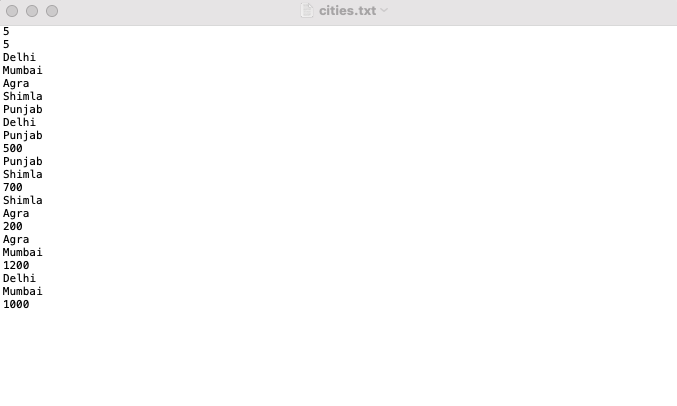

# Bus_Booking_system
• Implemented cities as graphs and used adjacency lists
• Calculates shortest distances via Dijkstra’s algorithms
• Showcases C++ OOPS features like abstraction and inheritance to
implement types of buses
• Shows an estimated time of arrival via calculated distances
.txt file storing the data of cities

.cpp file preiview while runtime

